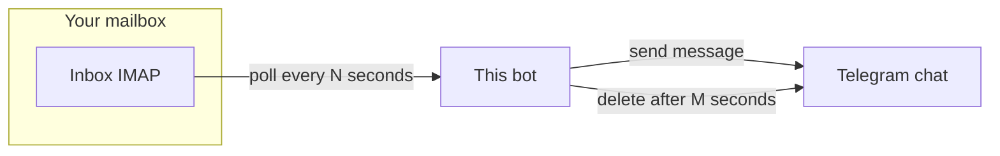

# Email-to-Telegram Code Bot

A Python bot that watches your Yahoo or Gmail inbox for emails matching a subject and sender, extracts a code with a regex, sends it to a Telegram chat, and auto-deletes that Telegram message after a delay.

---

## Quick start (recommended)

From the project root:

```bash
chmod +x install.sh   # once
./install.sh
```

This script will:

1. Create **`.venv`** if it does not exist and install **`requirements.txt`**
2. Copy **`config.example.yaml` → `config.yaml`** and **`credentials.example.yaml` → `credentials.yaml`** if those files are missing
3. Run **`scripts/bootstrap_credentials.py`**, which **prompts** for email address, email app password, and Telegram bot token when the files still contain example placeholders, and optionally asks for **`telegram.chat_id`** if it is still the example value
4. Start the bot with **`python run.py`**

- Run **`./install.sh --no-run`** to only set up the environment and files (no bot process).
- Later runs: **`source .venv/bin/activate`** then **`python run.py`**.

---

## What you need before it works

| Item | Purpose |
|------|---------|
| **Python 3.10+** | Runtime (3.11 works well) |
| **App password** for Yahoo or Gmail | IMAP login — **not** your normal email password |
| **Telegram bot token** | From [@BotFather](https://t.me/BotFather) → `/newbot` |
| **`telegram.chat_id`** | Where to post the code (DM or group); from `getUpdates` (see below) |
| **Filters in `config.yaml`** | Substrings for subject/sender + regex for the code |

---

## How it fits together



1. The bot connects to **IMAP** (Yahoo or Gmail).
2. It looks at recent messages and keeps those whose **subject** and **sender** contain your configured substrings.
3. It runs **`code_pattern`** on the body and takes the first match.
4. It sends **`message_template`** to Telegram (with `{code}` replaced) and schedules deletion after **`message_delete_after_seconds`**.

---

## Configuration

### Defaults (if omitted from YAML)

| Setting | Default | Meaning |
|---------|---------|---------|
| **`email.poll_interval_seconds`** | **30** | Seconds between inbox checks |
| **`telegram.message_delete_after_seconds`** | **300** | Seconds before the Telegram message is deleted (**5 minutes**) |

### `config.yaml`

Copy from the example if needed:

```bash
cp config.example.yaml config.yaml
```

Edit:

- **`email.provider`**: `yahoo` or `gmail`
- **`email.subject_filter`**: substring that must appear in the subject (case-insensitive)
- **`email.sender_filter`**: substring that must appear in the sender (case-insensitive)
- **`email.code_pattern`**: Python regex; first **capturing group** wins, else the full match (invalid regex → clear error at startup)
- **`email.poll_interval_seconds`**: poll interval (default **30**)
- **`telegram.chat_id`**: integer ID from Telegram (see below)
- **`telegram.message_delete_after_seconds`**: delete delay (default **300** = 5 minutes)
- **`telegram.message_template`**: e.g. `"Code: {code}"`

### `credentials.yaml`

```bash
cp credentials.example.yaml credentials.yaml
```

Edit (this file should stay **private** and is gitignored):

- **`email_user`**: full address, e.g. `you@yahoo.com`
- **`email_password`**: **app password** (with 2FA enabled on the account)
- **`telegram_bot_token`**: string from BotFather

Optional environment variables:

- **`CONFIG_PATH`**: path to `config.yaml` (default: `config.yaml` in the current working directory)
- **`CREDENTIALS_PATH`**: can also be set in `config.yaml` as `credentials_path`

Run from the **project root** (or set paths) so `config.yaml` resolves correctly.

---

## Telegram: token, `getUpdates` URL, and `chat_id`

### Bot token

1. Open Telegram → **@BotFather** → `/newbot` (or `/token` for an existing bot).
2. Copy the token into **`credentials.yaml`** as **`telegram_bot_token`**.

If the token is revoked or wrong, the bot logs a short message pointing you back to BotFather.

### Correct `getUpdates` URL (common mistake)

The API path must include the word **`bot`** **immediately before** the token:

```text
https://api.telegram.org/bot<YOUR_BOT_TOKEN>/getUpdates
```

A URL **without** `bot` before the token returns **404 Not Found**.

### Getting `chat_id`

1. Add your bot to the **group** (or open a **private** chat with the bot).
2. Send a message the bot can see. In **groups**, with default bot privacy, the bot may only see **commands** or **mentions** — e.g. `/start@YourBotName` or a message that `@mentions` the bot.
3. Open **`getUpdates`** in a browser and find **`"chat":{"id": ...}`**.
   - **Private chat**: `id` is usually a **positive** integer.
   - **Group / supergroup**: `id` is often **negative** (e.g. `-100…`).
4. Put that number in **`config.yaml`** as **`telegram.chat_id`**.

Alternatively add **@userinfobot** to the group; it may show the group id.

---

## Email: app passwords (do not use your normal password)

| Provider | What to do |
|----------|------------|
| **Gmail** | Enable 2-Step Verification → [App passwords](https://myaccount.google.com/apppasswords) → use that 16-character value as **`email_password`**. Set **`email.provider: gmail`**. |
| **Yahoo** | Enable two-step verification → generate an **app password** in account security → use it as **`email_password`**. Enable **IMAP** for the account in mail settings. Set **`email.provider: yahoo`**. |

If IMAP login fails, the bot logs a focused message: use an **app password**, correct **`email_user`**, and ensure **IMAP** is enabled — not a full stack trace for that case.

---

## Manual install (without `install.sh`)

### Python venv + pip

```bash
python3 -m venv .venv
source .venv/bin/activate   # Windows: .venv\Scripts\activate
pip install -r requirements.txt
cp config.example.yaml config.yaml
cp credentials.example.yaml credentials.yaml
# edit config.yaml and credentials.yaml, then:
python run.py
```

### Conda

If you use conda and see an error that **Terms of Service** must be accepted for `repo.anaconda.com`, either run the `conda tos accept ...` commands conda prints, or prefer **`python3 -m venv .venv`** + **`pip install -r requirements.txt`** to avoid that step.

---

## Troubleshooting

| Symptom | What to check |
|---------|----------------|
| **`404`** on `getUpdates` | URL must be `.../bot<TOKEN>/getUpdates`, not `.../<TOKEN>/getUpdates`. |
| **`result: []`** in `getUpdates` | Send a new message to the bot or group; in groups use `/start@Bot` or `@mention` if updates stay empty. |
| **`AUTHENTICATIONFAILED` / invalid credentials** | Use an **app password**, not your normal password; correct full **email**; **IMAP** enabled (Yahoo). |
| **Telegram: chat not found / wrong chat** | **`telegram.chat_id`** must match the **chat** you tested in `getUpdates` (group id is often negative). Bot must be **in** that group. |
| **Invalid token** | Regenerate token in BotFather; update **`credentials.yaml`**. |
| **YAML errors at startup** | Fix indentation/quotes in **`config.yaml`** / **`credentials.yaml`**; the error line is in the message. |
| **Regex error at startup** | **`email.code_pattern`** must be valid Python regex. |
| **Unknown provider** | **`email.provider`** must be **`gmail`** or **`yahoo`**. |

---

## Behaviour

- Polls the inbox every **`poll_interval_seconds`** (default **30**).
- Only considers emails whose subject contains **`subject_filter`** and whose sender contains **`sender_filter`**.
- Extracts the first match of **`code_pattern`** from the body (plain text or HTML stripped).
- For each new matching email (by IMAP UID), sends the code to Telegram and records the UID in **`processed_uids.json`** so the same message is not sent twice.
- Schedules deletion of that Telegram message after **`message_delete_after_seconds`** (default **300**). If the process stops, scheduled deletions may be skipped.

## License

MIT
